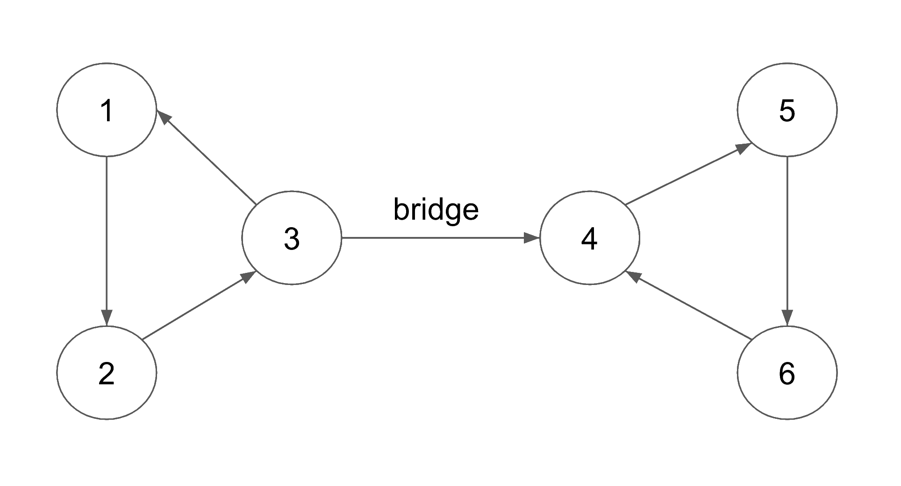

[문제 풀러가기](https://www.acmicpc.net/problem/11308)

모든 노드끼리 경로가 존재하는 `무방향 그래프`가 주어졌을 때,

각 간선에 방향을 줘도 모든 노드끼리 경로가 존재할 수 있는지 확인하는 문제이다.

## 문제 해설

> 방향 그래프에서 각 노드 x의 subtree에서 x 또는 x의 ancestor로 가는 `back edge`가 존재하면 경로는 존재한다.
> 즉, `bridge`가 없으면 된다.

아래 그림과 같은 무방향 그래프가 있다고 하자.


이 그래프는 bridge가 존재하므로 안된다.

구체적으로, 3번 노드의 subtree에서 3번 노드 또는 3번 노드의 ancestor로 가는 간선이 존재하지 않으므로 안된다.



다음은 가능한 경우를 살펴보자.


해당 그래프에 bridge가 없으므로 가능하다.

즉, 모든 노드의 subtree에서 해당 노드 또는 해당 노드의 ancestor로 가는 간선이 존재하므로 가능하다.


그렇다면 간선의 방향은 어떻게 정하면 될까?


한 가지 방법은 `forward edge`는 parent에서 child 방향으로,

`back edge`는 child에서 ancestor 방향으로 가도록 설정하면 된다.

forward edge와 back edge를 구분하고 bridge의 존재여부를 확인하기 위해 `dfs tree`를 사용하면 된다.

## 구현

```cpp:title=solution.cpp
#include <bits/stdc++.h>

using namespace std;

int main() {
    ios::sync_with_stdio(false);
    cin.tie(NULL);

    int t;
    cin >> t;

    // for each test case
    while (t--) {
        // input start
        int n, m;
        cin >> n >> m;

        vector<vector<int>> adj(n + 1);

        while (m--) {
            int u, v;
            cin >> u >> v;
            adj[u].push_back(v);
            adj[v].push_back(u);
        }
        // input end

        vector<pair<int, int>> edge;
        vector<int> tin(n + 1), low(n + 1);
        int t = 1;
        bool ok = true;

        function<void(int, int)> dfs;
        dfs = [&](int x, int p) {
            tin[x] = low[x] = t++;
            for (int nxt : adj[x]) {
                if (nxt == p) continue;
                if (tin[nxt]) {
                    low[x] = min(low[x], tin[nxt]);
                    // highlight-start
                    // orient all back edges child to ancestor
                    if (tin[x] > tin[nxt]) {
                      edge.push_back({x, nxt});
                    }
                    // highlight-end
                } else {
                    dfs(nxt, x);
                    // highlight-start
                    // edge [x -> nxt] is a bridge
                    if (low[nxt] > tin[x]) {
                        ok = false;
                        return;
                    }
                    // highlight-end
                    low[x] = min(low[x], low[nxt]);
                    // highlight-start
                    // orient all forward edges parent to child
                    edge.push_back({x, nxt});
                    // highlight-end
                }
            }
        };

        dfs(1, -1);

        if (ok) {
            cout << "YES\n";
            for (auto [u, v] : edge) {
                cout << u << ' ' << v << '\n';
            }
        } else {
            cout << "NO\n";
        }
    }

    return 0;
}
```
